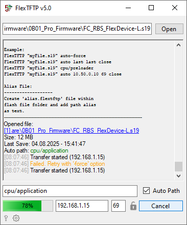

# FlexTFTP

![Visual Studio](https://img.shields.io/badge/Visual%20Studio-5C2D91.svg?style=flat&logo=data:image/png;base64,iVBORw0KGgoAAAANSUhEUgAAACAAAAAgCAYAAABzenr0AAAABHNCSVQICAgIfAhkiAAAAAlwSFlzAAAA3QAAAN0BcFOiBwAAABl0RVh0U29mdHdhcmUAd3d3Lmlua3NjYXBlLm9yZ5vuPBoAAAT9SURBVFiFtZdtTJVlGMd/9/085wU4HJQXlXCtNDFIbZFokiJjboVuYX6wtlzuWGnptGEvm4nNENcq02Wjsg8yp3zoZQtb6dpaMhQpzNU0YyUhmQwU4uXwcoDznHP3AThwOM+BI9j/0zn3dT3X//9cz3Xd93ULpRSRYMeO0zbV58zVUPlKiTSUSkaQDICiCSGahFC1PsRJYXf/cPhwXn8kccVEAgq2nE32+3kTxDNAbERqoQtUmZQUHTqyomlSAlyuCrtT1wuBAiA6QuKx6AUOuQ2juLQ0py9iAdtcFbN0TS9HsHSSxMFQ/GT4jLUlpTnNEwrYvqVyofTLU8DsO0I+ght+6V/94ZHsy2EFbHNVzNJ1/cL/QB4QYRhG5uhMyOEfLleFXdf08qmSp6Y5ycqeQVS0bmaerWt6uctVYR9eCHgNFdyUvnn6omk8v/UBNE2w7mk/NeebqT7bzD9/9444CZYOcRXC0CcYbDVRx+SrnUUZ03FtSUdKEWI7sP9nrl/rQ4yYeqVU9x06sqJJAgz2+eTJM5YksOlFc3IAw/DR2upmVLlFD3GitbUttQnDdhywjX3wnjkOlq2YwfWGbnw+8/1iSVYSGzbdjxDm5ABVlY001Hfi9RpER9uGMiHmn/7+ykFd9TlzBSpkh5ufHsfWgoUAPPhwEkc/ruVWc/BekrVyBk9tSA1LPBYezwCtrW4SE50IQazqc+ZKDZVv5qzpI2+UfFcMr+/JICMzIbC2ctWsEHKloOVWL6EYiTUsQinQUPm6UiINwp8HSoEQYLFKNm5OY25qI50dA6xZe2+QX5d7gA/eu0j6wkTWrZ8XWSaS4tIlSiWHZQY6O/r5tOQSwxvW8pyUEPLa3/6l4KUzXKy5aRrKrDw8ngFaWjoe0gNHqjk/AKe/rqers5+duxaHFFv5F1c5fvR3/P7IjvXR6O/zOmQ44+hwQgjSFySYVnpqWjzT40MaKAjhG0QoicL8vB5SoGmCnbsWk/fEnBHTqPSkL0jg4Ee5ZGTOHFeEGTQpDIkQpgKGOWKdVpavTAHA6/XzyeFfeeuNavr7fQFfZ5yVwn3LePa5wW04BGFSIKX06EKoWqXInkjtzaYe3i2+QH1dBwD7CqspLHoEe5Qe4Hhy/TwMwz9RqAA0i7wufYiTZkZ35wA93V4AfqxqYue2igA5wJVLrezddZ7eHm/Qc7oeWlbhSkCX8jOxffspm/DEtmAy7/l8Bil326mpDhlkApg7bxp7387CEWsN63Ng/wWqKhuDRQmhohOt0+Tg9KrKzB7UNJ26P7rDBgb462oHe147h7sz/BBsVgJ2u+XyiRN5bgkgJUUMDpAhcDjsxMc7xhXRcM3N7lfP0d4WOnd6PAbt7cHihACblY0waiR7+YVzxcDucCTd3X20tY2fjeQUB0XvPEpiUhT1dZ189+01Ks/coM9jBPlFR9mqysrzlsOoichtGMVOTV8VbhJ2OAanqPFENDV2s/uVszjjbNT92W7qY7HqXV5r1OPD/297KI0kE+GgadIXE23JPPZl3i/Da0E9U1Ka0+yX/tXAjXBBIqmJcOQOhy1/NDlM4WJyO5nQda3XapXZZV+tuTjWZnoYlZTmNLt9Rg6wnyl0hxAQE2OrEDGxM83I4Q5cTs0yIaVUNrt+yWLRNh/7/LGacUXeieu52+3p7e0ZsFksogEhvlFR/vfLytaYt8EY/AcgFAtO53snOAAAAABJRU5ErkJggg==&logoColor=white)

TFTP Firmware Update Tool with support of special SRecord (*.s19) flash files.

## Update

Integrated auto-update via GitHub releases.

## Hotkeys

Enter - Start transfer \
ESC   - Stop transfer

## Command line parameters

FlexTFTP.exe
    TargetFile
    [Path | "auto" | "auto-force"]
    [IP | "last"]
    [Port | "last"]
    [Afterwards action "close"]
    ["colors"]
    ["test"]

### TargetFile

    File path to file which should 
    be flashed

### Path

    Target path 
    (e.g. "cpu/application"). 
    Set to "auto" if auto-path option 
    should be used.

### IP

    Target IPv4 address.
    Set to "last" if last saved IP 
    should be used.

### Port

    Target port (e.g. 69)
    Set to "last" if last saved port 
    should be used.

### Action

    Action which should be performed
    after transfer.
    This action is performed even 
    if transfer failed.
    "notclose" = Application will not be closed.
    "close" = Application will be closed 
    without delay.
    Default behavior will close application
    after a few seconds.

### Colors

    Will activate output colorization in CLI mode

### Test

    Transfer is restarted every time at 60%
    to test transfer stability

#### Example

    FlexTFTP "myFile.s19"
    FlexTFTP "myFile.s19" auto last last close
    FlexTFTP "myFile.s19" cpu/preloader
    FlexTFTP "myFile.s19" auto 10.50.0.10 69 close

## Alias File

Create 'alias.flextftp' file within
flash file folder and add path alias
as text.