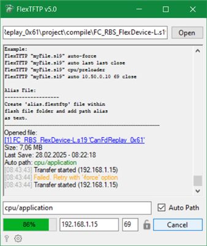

# FlexTFTP

TFTP Firmware Update Tool with support of special SRecord (*.s19) flash files.

## Update

Integrated auto-update via GitHub releases.

## Hotkeys

Enter - Start transfer \
ESC   - Stop transfer

## Command line parameters

FlexTFTP.exe

    [Path | "auto"]
    [IP | "last"]
    [Port | "last"]
    [Afterwards action "close"]

### TargetFile

    File path to file which should 
    be flashed

### Path

    Target path 
    (e.g. "cpu/application"). 
    Set to "auto" if auto-path option 
    should be used.

### IP

    Target IPv4 address.
    Set to "last" if last saved IP 
    should be used.

### Port

    Target port (e.g. 69)
    Set to "last" if last saved port 
    should be used.

### Action

    Action which should be performed
    after transfer.
    This action is performed even 
    if transfer failed.
    "notclose" = Application will not be closed.
    "close" = Application will be closed 
    without delay.
    Default behavior will close application
    after a few seconds.

#### Example

    FlexTFTP "myFile.s19"
    FlexTFTP "myFile.s19" auto last last close
    FlexTFTP "myFile.s19" cpu/preloader
    FlexTFTP "myFile.s19" auto 10.50.0.10 69 close

## Alias File

Create 'alias.flextftp' file within
flash file folder and add path alias
as text.